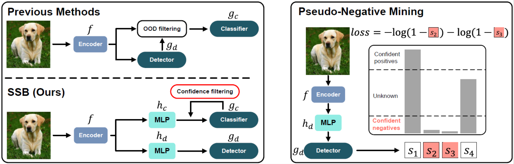

# SSB: Simple but Strong Baseline for Boosting Performance of Open-Set Semi-Supervised Learning
[](https://github.com/YUE-FAN/CoSSL/blob/main/LICENSE)
[](https://www.python.org/)
[](https://pytorch.org/)

This is the official PyTorch repository of the ICCV 2023 Paper ["SSB: Simple but Strong Baseline for Boosting Performance of Open-Set Semi-Supervised Learning"](https://arxiv.org/abs/2311.10572) by [Yue Fan](https://www.mpi-inf.mpg.de/departments/computer-vision-and-machine-learning/people/yue-fan), [Dengxin Dai](https://people.ee.ethz.ch/~daid/), [Anna Kukleva](https://annusha.github.io/), and [Bernt Schiele](https://www.mpi-inf.mpg.de/departments/computer-vision-and-multimodal-computing/people/bernt-schiele/).

If you have any questions on this repository or the related paper, feel free to [create an issue](https://github.com/YUE-FAN/SSB/issues/new) or [send me an email](mailto:yfan@mpi-inf.mpg.de). 


#### Summary

* [Introduction](#introduction)
* [Installation](#installation)
* [Data Preparation](#data-preparation)
* [Running Experiments](#running-experiments)
* [Performance](#performance)
* [Citation](#citation)
* [Acknowledgements](#acknowledgements)

## Introduction

Semi-supervised learning (SSL) methods effectively leverage unlabeled data to improve model generalization. However, SSL models often underperform in open-set scenarios, where unlabeled data contain outliers from novel categories that do not appear in the labeled set. In this paper, we study the challenging and realistic open-set SSL setting, where the goal is to both correctly classify inliers and to detect outliers. Intuitively, the inlier classifier should be trained on inlier data only. However, we find that inlier classification performance can be largely improved by incorporating high-confidence pseudo-labeled data, regardless of whether they are inliers or outliers. Also, we propose to utilize non-linear transformations to separate the features used for inlier classification and outlier detection in the multi-task learning framework, preventing adverse effects between them. Additionally, we introduce pseudo-negative mining, which further boosts outlier detection performance. The three ingredients lead to what we call Simple but Strong Baseline (SSB) for open-set SSL. In experiments, SSB greatly improves both inlier classification and outlier detection performance, outperforming existing methods by a large margin.
<p align="center">
    
</p>

> Figure: **Left**: Our baseline for open-set SSL consists of an inlier classifier gc, an outlier detector gd, and a shared feature
encoder f whose features are separated from the task-specific heads by two projection heads hc and hd. Unlike the detectorbased filtering, we adopt confidence-based pseudo-labeling by the inlier classifier to leverage useful OOD data for classifier
training. For detector training, we train one-vs-all (OVA) classifiers as in OpenMatch. **Right**: Given the inlier scores
(s1 to s4), pseudo-negative mining selects confident negatives (s2 and s3 in the figure), whose inlier scores are lower than a
pre-defined threshold, as pseudo-outliers to help the outlier detector training.


## Installation

We provide the conda environment we used to run all the experiments as a `yml` file. 

Please install it by: 
`conda env create -f environment.yml`


## Data Preparation
Please download the following datasets and put them under the `data` dir:
[CIFAR-10](https://www.cs.toronto.edu/~kriz/cifar.html), [CIFAR-100](https://www.cs.toronto.edu/~kriz/cifar.html), [SVHN](http://ufldl.stanford.edu/housenumbers/), [Stanford_Dogs](http://vision.stanford.edu/aditya86/ImageNetDogs/), [CUB_200_2011](https://www.vision.caltech.edu/visipedia/CUB-200-2011.html), [Describable Textures Dataset](https://www.robots.ox.ac.uk/~vgg/data/dtd/), [Caltech-256](https://data.caltech.edu/records/nyy15-4j048), [OxfordFlowers102](https://www.robots.ox.ac.uk/%7Evgg/data/flowers/102/).
LSUN and ImageNet are already provided in `data`.

After processing, the data folder should look like this:
```
$SSB_ROOT/data/
    cifar-10/
    cifar-100/
    LSUN_fix/
    Imagenet_fix/
    Stanford_Dogs/
    CUB_200_2011/
    oxford_flowers102/
    256_ObjectCategories/
    dtd/
```
For CIFAR-10 experiments, SVHN, CIFAR-100, LSUN, and ImageNet are used as OOD data.

For CIFAR-100 experiments, SVHN, CIFAR-10, LSUN, and ImageNet are used as OOD data.

For ImageNet experiments, LSUN, DTD, CUB, Flowers102, Caltech256, and Stanford_dogs are used as OOD data.


## Running Experiments

We provide `fix_ssb.sh`, `flex_ssb.sh`, and `sim_ssb.sh` for reproducing results in Figure 3 and 4 in our paper.
Each `.sh` file contains 7 experiments of different settings.

### Example
Here is an example of running SSB on CIFAR-10 with 25 labels per class with FixMatch backbone:

Run pretrain phase for 475 epochs:
```
python main_fix.py --dataset cifar10 --num-labeled 25 --out ./saved_models/cifar10/fixmatch/wresnetleaky2_C6_N25_mlp3_head1024_seed1 --arch wideresnet --lambda_x 1 --lambda_u 1 --lambda_oem 0.1 --lambda_socr 0.5 --batch-size 64 --mu 2 --lr 0.03 --expand-labels --seed 1 --opt_level O2 --no-progress --both_head_increment mlp3 --threshold 0.95 --hidden_dim_increment 1024
```
Applying SSB afterwards:
```
python main_fix_ssb.py --dataset cifar10 --num-labeled 25 --resume ./saved_models/cifar10/fixmatch/wresnetleaky2_C6_N25_mlp3_head1024_seed1/checkpoint_475.pth.tar --out ./saved_models/cifar10/ours/wresnetleaky2_C6_N25_mlp3_head1024_ova_ckpt475_clf_threshold_ovaTh001_seed1/ --arch wideresnet --lambda_x 1 --lambda_u 1 --lambda_oem 0.1 --lambda_socr 0.5 --batch-size 64 --lr 0.03 --skip_expand --expand-labels --seed 1 --opt_level O2 --mu 2 --no-progress --both_head_increment mlp3 --hidden_dim_increment 1024 --return_idx --ova_neg_loss all --ova_neg_DA ws --ova_unlabeled_threshold 0.01 --ova_unlabeled_neg_DA s --threshold 0.95
```


## Performance

| Test Acc. / AUROC | CIFAR-10 6 known classes 25 labels | CIFAR-10 6 known classes 50 labels |
|-------------------|:----------------------------------:|:----------------------------------:|
| `FixMatch+SSB`    |   `91.74 ± 0.24 / 95.86 ± 1.37`    |   `92.18 ± 0.33 / 97.65 ± 0.19`    |
| `FlexMatch+SSB`   |   `84.72 ± 0.49 / 90.32 ± 0.75`    |   `84.26 ± 1.36 / 93.16 ± 3.63`    |
| `SimMatch+SSB`    |   `88.51 ± 2.86 / 97.54 ± 0.08`    |   `90.82 ± 0.47 / 94.07 ± 0.40`    |

| Test Acc. / AUROC | CIFAR-100 55 know classes 25 labels | CIFAR-100 55 known classes 50 labels |
|-------------------|:-----------------------------------:|:------------------------------------:|
| `FixMatch+SSB`    |            `70.64 ± 0.36 / 82.91 ± 0.30`            |            `73.70 ± 0.75 / 85.89 ± 0.07`             |
| `FlexMatch+SSB`   |            `68.28 ± 0.74 / 83.62 ± 0.43`            |            `72.65 ± 0.25 / 85.97 ± 0.46`             |
| `SimMatch+SSB`    |            `70.77 ± 0.54 / 84.77 ± 0.52`            |            `75.15 ± 0.34 / 84.60 ± 0.18`             |

| Test Acc. / AUROC | CIFAR-100 80 know classes 25 labels | CIFAR-100 80 known classes 50 labels |
|-------------------|:-----------------------------------:|:------------------------------------:|
| `FixMatch+SSB`    |            `64.20 ± 0.41 / 81.71 ± 0.86`            |            `67.97 ± 0.20 / 80.81 ± 1.02`             |
| `FlexMatch+SSB`   |            `60.39 ± 1.89 / 79.85 ± 0.94`            |            `65.79 ± 0.06 / 83.32 ± 0.36`             |
| `SimMatch+SSB`    |            `66.48 ± 0.77 / 82.39 ± 2.97`            |            `70.27 ± 0.19 / 81.16 ± 2.10`             |


| Test Acc. / AUROC | ImageNet 5% labels | 
|-------------------|:------------------:|
| `FixMatch+SSB`    |   `91.80 ± 0.05 / 82.80 ± 1.18`    |
| `FlexMatch+SSB`   |   `86.90 ± 0.70 / 75.42 ± 0.24`    |
| `SimMatch+SSB`    |   `91.30 ± 0.65 / 75.54 ± 0.10`    |

* The performance for the PyTorch version is under checking.

## Citation

Please cite our paper if it is helpful to your work:

```bibtex
@inproceedings{fan2023ssb,
  title={SSB: Simple but Strong Baseline for Boosting Performance of Open-Set Semi-Supervised Learning},
  author={Fan, Yue and Kukleva, Anna and Dai, Dengxin and Schiele, Bernt},
  booktitle={Proceedings of the IEEE/CVF International Conference on Computer Vision},
  pages={16068--16078},
  year={2023}
}
```

## Acknowledgements

Our implementation is largely based on the following repository:

* [OpenMatch: Open-set Consistency Regularization for Semi-supervised Learning with Outliers](https://github.com/VisionLearningGroup/OP_Match)
